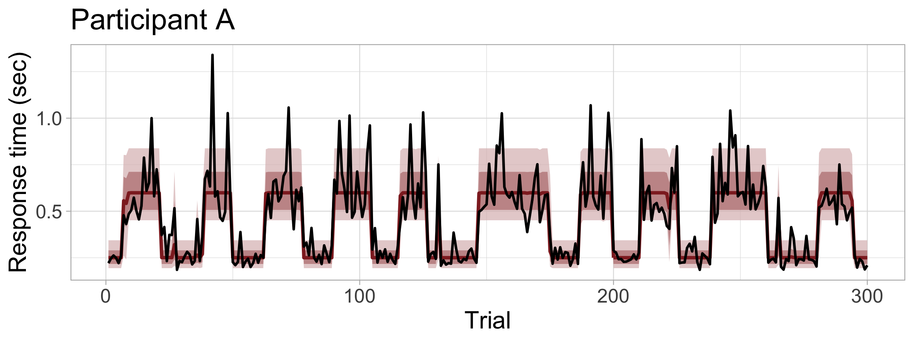
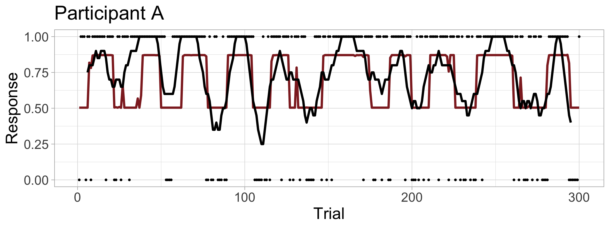

# Hidden Markov model of evidence accumulation





This repository is associated with the article

> Kucharský, Š., Tran, N., Veldkamp, K., Raijmakers, M. E. J., & Visser, I. (2020, December 16). Hidden Markov Models of Evidence Accumulation in Speeded Decision Tasks. Retrieved from [psyarxiv.com/yzn2d](https:://www.psyarxiv.com/yzn2d)

### Dependencies (setting up correct version of Stan)

The models were written in Stan and require `CmdStan` version above `2.24.0`. The code was run using `cmdstanr` package in R. To set up the computational environment correctly in the analysis scripts, the correct version of `CmdStan` is loaded using the following command:

```
set\_cmdstan\_path(readRDS("path\_to\_cmdstan.Rds"))
```

The object `path\_to\_cmdstan.Rds` actually contains just a string that specifies the folder where the appropriate version of CmdStan is installed:

 ```
 > readRDS("path\_to\_cmdstan.Rds")
[1] "~/.cmdstan/cmdstan-2.24.0-rc1/"
 ```
 
 For it to work on a computer with different location to `CmdStan`, run the following command in R:
 
 ```
 path\_to\_cmdstan <- "my/path/to/cmdstan/installation"
 saveRDS(path\_to\_cmdstan, "path\_to\_cmdstan.Rds")
 ```

### Structure of this repository

1. [data/](data/) folder contains cleaned data from Dutilh, et al. (2010) that are reanalyzed in the article.
2. [stan/](stan/) folder contains stan models and scripts:
	* [helpers/](stan/helpers/) contains some functions that are used in the stan models
	* [hmm/](stan/hmm/) contains manually written backward, forward, and forward-backward algorithm that was used to check the use of the new `hmm_marginal_lpdf()` function implemented in CmdStan version 2.24.0.
	* [later/](stan/later/) contains functions that implement the simplified LBA model in Stan
	* Additionally, the folder contains models like [hmm\_normal.stan](stan/hmm\_normal.stan) that were used to check the correctness of the use of the new HMM functions in Stan language (see also script [hmm\_normal.R](scripts/hmm\_normal.R)).
3. [scripts/](scripts/) folder contains the R scripts used to produce the output presented in the article. The scripts are meant to be run in order. Here the brief summary of what each script does.
	* [00\_get\_dutilh\_2010\_data.R](scripts/00\_get\_dutilh\_2010\_data.R) downloads, cleans and saves data from Dutilh, et al. (2010) study.
	* [01\_sim\_prior\_predictives.R](scripts/01\_sim\_prior\_predictives.R) simulates data from a prior predictive distribution. The script saves the hyperparameters in [hyperparameters.Rds](saves/hyperparameters.Rds) object, and the simulated data (and true parameter values) inside [prior\_predictives.Rds](saves/prior\_predictives.Rds).
	* [02\_sim\_map\_estimation.R](scripts/02\_sim\_map\_estimation.R) fits the prior predictive data sets using maximum a posteriori estimation, saves the results in [map\_estimates\_simulation.Rds](saves/map\_estimates\_simulation.Rds) object, and computes parameter recovery results. 
	* [03\_sim\_full\_bayes\_estimation.R](scripts/03\_sim\_full\_bayes\_estimation.R) fits the prior predictive data sets using MCMC, and saves the results inside of folder under [saves/sbc](). (The actuall saved chains are not uploaded to GitHub due to huge size of the files)
	* [04\_sim\_full\_bayes\_results.R](scripts/04\_sim\_full\_bayes\_results.R) processes the fitted models on the simulated data, and creates output for the Simulation-based calibration model sensitivity analysis, parameter recovery, and coverage of the posterior credible intervals.
	* [05\_fit\_dutilh\_data.R](scripts/05\_fit\_dutilh\_data.R) is a script that fits data from a single participant. It is mean to be run from a terminal using command: `Rscript --vanilla scripts/05_fit_dutilh_data.R A` to fit data from participant "A", etc. The resulting fit objects are saved in folder [saves/hmm_later/]().
	* [06\_results\_dutilh\_data.R](scripts/06\_results\_dutilh\_data.R) processes the fitted models on the Dutilh, et al. (2010) data and produces the figures and tables presented in the article.
	* [hmm_normal.R](scripts/hmm_normal.R) checks  the correctness of the use of the new `hmm_marginal_lpdf()` function.
	* [hmm_later.R](scripts/hmm_later.R) is a "legacy" script. Originally, the simulations were run here, later the code was refactored to make it easier to make sense of the code.
4. [saves/](saves/) folder contains some R objects saved during the project for convenience.
5. [R/](R/) folder contains some R functions for convenience.
6. [figures/](figures) folder contains all figures generated in this project.


